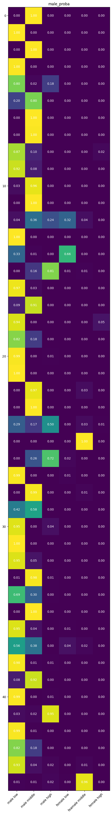
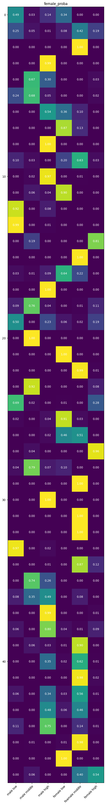

# voice-emb
男性:低/中/高・女性:低/中/高の6クラス分類の結果を用いて、成分の分類みたいなことができるか検証。

## データ
[JVS corpus](https://sites.google.com/site/shinnosuketakamichi/research-topics/jvs_corpus)
+ jvs_ver1をダウンロード

##  正解クラスとする話者を選択
gender_f0range.txtのmaxf0[Hz]でソートして声の高い人・低い人を確認。

```
$ python3 00_show_voice_range.py jvs_ver1/gender_f0range.txt 
Male low Top3
   speaker Male_or_Female  minf0[Hz]  maxf0[Hz]
5   jvs006              M         70        190
77  jvs078              M         70        220
41  jvs042              M         70        220
Male high Top3
   speaker Male_or_Female  minf0[Hz]  maxf0[Hz]
97  jvs098              M         70        340
31  jvs032              M         70        335
46  jvs047              M         70        330
Male middle3
   speaker Male_or_Female  minf0[Hz]  maxf0[Hz]
73  jvs074              M         70        280
27  jvs028              M         70        280
76  jvs077              M         70        280
-----
Female low Top3
   speaker Male_or_Female  minf0[Hz]  maxf0[Hz]
90  jvs091              F        115        330
15  jvs016              F        110        340
63  jvs064              F        120        350
Female high Top3
   speaker Male_or_Female  minf0[Hz]  maxf0[Hz]
9   jvs010              F        125        480
65  jvs066              F        120        480
60  jvs061              F        140        470
Female middle3
   speaker Male_or_Female  minf0[Hz]  maxf0[Hz]
54  jvs055              F        120        410
95  jvs096              F        135        410
18  jvs019              F        125        410
```

以上の結果より、男低/男中/男高/女低/女中/女高をそれぞれjvs006/jvs074/jvs098/jvs091/jvs096/jvs010とした。

## 学習データの作成
MFCCを特徴量とした（適当）。
```
$ python3 01_make_train_data.py jvs_ver1
0:jvs006...
1:jvs074...
2:jvs098...
3:jvs091...
4:jvs096...
5:jvs010...
```

## 学習
```
$ python3 02_train.py
```

## 評価
jvs_ver1の残りの人を6クラス分類して結果を確認

```
$ python3 03_eval.py jvs_ver1
```

### 男性結果
クラス判定が男側によっている。なかなか高い判定にならないが悪くはなさそう。
+ 縦: 男性をmaxf0を低い順にソート
+ 横: 各クラス(順に男低/男中/男高/女低/女中/女高)


### 女性結果
結構男性側のクラスになってしまう。選び方が悪かったか？ある意味面白い結果とも言える。
+ 縦: 女性をmaxf0を低い順にソート
+ 横: 各クラス(順に男低/男中/男高/女低/女中/女高)
